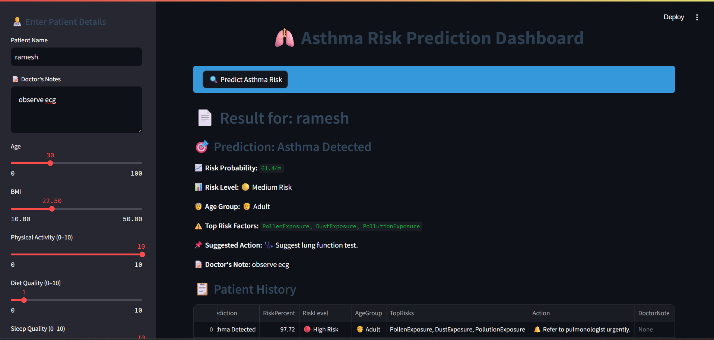
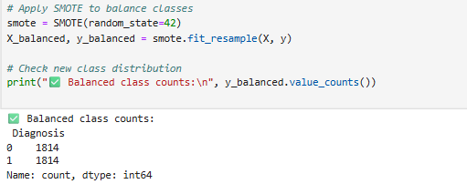
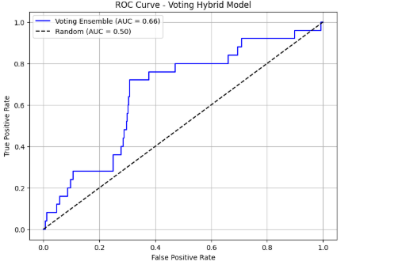
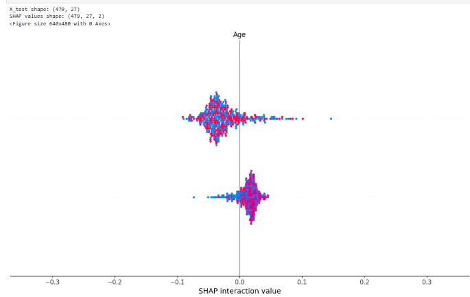

# 🫁 AsthmaXpert: A Hybrid Explainable AI System for Personalized Asthma Risk Prediction and Clinical Decision Support

**AsthmaXpert** is a comprehensive medical dashboard designed to assist healthcare professionals in predicting and managing asthma risks. Leveraging a **Hybrid Voting Ensemble Model**, the application provides real-time risk assessments, explains key risk factors, and offers clinical decision support based on patient-specific data. Also attached my Research paper of that project.

---

## 🌟 Key Features

- **✅ Real-time Prediction**: Instant asthma risk assessment using a pre-trained Voting Hybrid Ensemble model.
- **📊 Risk Stratification**: Automatically categorizes patients into `🟢 Low Risk`, `🟡 Medium Risk`, or `🔴 High Risk`.
- **🔍 Explainable AI (XAI)**: Identifies the top 3 risk factors driving each individual prediction (e.g., Dust Exposure, Smoking, Pollution).
- **📋 Clinical Decision Support**: Suggests actionable next steps (e.g., "Refer to pulmonologist urgently," "Suggest lung function test").
- **📝 Patient Record Management**: 
  - Save patient details and doctor's notes.
  - View history of past predictions within a searchable dashboard.
  - Export all records to **Excel** (`.xlsx`) for clinical review.
- **🎨 Premium UI/UX**: Custom-styled Streamlit interface for a clean, clinical aesthetic.

---

## 🛠️ Tech Stack

- **Languge**: Python
- **Frontend**: Streamlit
- **Machine Learning**: Scikit-learn (Voting Classifier), Joblib
- **Data Handling**: Pandas, NumPy, OpenPyXL
- **Styling**: Custom CSS for a professional medical look

---

## 📂 Project Structure

```text
├── Asthmaapp.py              # Main Streamlit Application
├── style.css                 # Custom Clinical Branding & Styles
├── voting_hybrid_model.pkl    # Pre-trained Ensemble Model
├── requirements.txt           # Project Dependencies
├── 1.Missing outlier categorical.ipynb # Data Preprocessing
├── 2.EDA.ipynb               # Exploratory Data Analysis
├── 4.Model Training.ipynb     # Model Development & Training
├── asthma_disease_data.csv    # Original Dataset
├── asthma_cleaned_dataset.csv # Processed Dataset
└── README.md                 # Project Documentation
```

---

## 🚀 Installation & Setup

### 1. Clone the Repository
```bash
git clone https://github.com/your-username/asthmaxpert.git
cd asthmaxpert
```

### 2. Create a Virtual Environment (Optional but Recommended)
```bash
python -m venv venv
source venv/bin/activate  # On Windows: venv\Scripts\activate
```

### 3. Install Dependencies
```bash
pip install -r requirements.txt
```

### 4. Run the Application
```bash
streamlit run Asthmaapp.py
```

---

## 🩺 Prediction Parameters
The model considers several clinical and environmental factors:
- **Demographics**: Age, BMI
- **Lifestyle**: Physical Activity, Diet Quality, Sleep Quality, Smoking Status
- **Environmental**: Pollution, Pollen, and Dust Exposure
- **Clinical**: Lung Function (FEV1, FVC, Ratio), Symptom Score, Family History, Allergy History

---

## 📈 Model Analysis & Insights
The project includes detailed analysis as seen in the exploratory phase:
- **EDA & Preprocessing**: Handled missing values, outliers, and categorical encoding.
- **Visualization**: ROC curves, Confusion Matrices, and SHAP analyses (see notebooks).
- **Hybrid Approach**: Combines multiple classifiers to achieve higher accuracy and robustness in clinical settings.

---

## 📸 Project Highlights

### 🖥️ Clinical Dashboard

*Real-time AI-powered asthma risk prediction interface.*

### 🤖 Model Performance & Explainability

| SMOTE Data Balancing | ROC Curve Analysis |
| :---: | :---: |
|  |  |

### 🔍 Explainable AI (SHAP)

*Identifying the key clinical and environmental factors driving patient risk.*

---

## 🤝 Contributing
Contributions are welcome! If you have suggestions or find bugs, feel free to open an issue or submit a pull request.

## 📄 License
This project is for educational/research purposes. Please consult a medical professional for clinical diagnosis.
